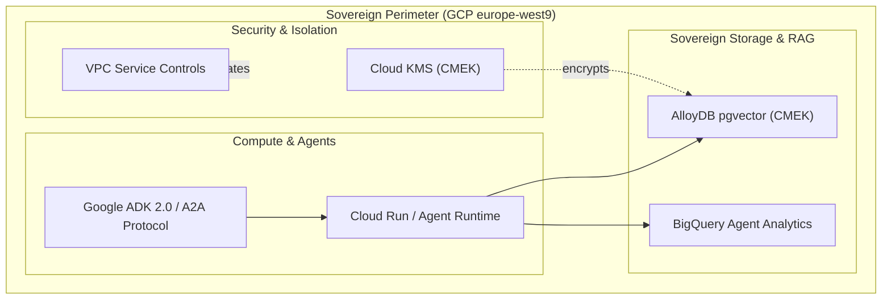

# Hi there, I'm Kerdjou Tigroudja 👋

[](https://kerdjou.dev)
[-4285F4?style=for-the-badge&logo=google-cloud&logoColor=white)](https://cloud.google.com)
[](https://cloud.google.com/vertex-ai)
[](https://python.org)
[](https://fastapi.tiangolo.com)
[](https://opentelemetry.io)

```
========================================================================================
  AI Engineer GCP | Sovereign AI Systems Architect | Multi-Agent Systems & Governance
========================================================================================
```

> **I build deterministic, observable, and sovereign multi-agent systems on Google Cloud Platform.**  
> 100% self-taught engineer. My credentials are not paper diplomas; they are auditable codebases, reproducible test suites, and live serverless services.

---

## 🏛️ Proof of Work — Flagship Trio

### 1️⃣ [K-SCM — Sovereign Compliance Mesh](https://github.com/kerdjou-tigroudja/k-scm-showcase) `[Operational — Live Cloud Run]`
* **Theme :** Universal static analysis & pre-audit tool for **EU AI Act** & **GDPR** compliance across multi-language repositories (Python, TypeScript, Go, Java) and IaC configurations (Terraform, Dockerfiles).
* **Live Architecture :** Deployed on Cloud Run in Paris (`europe-west9`), serving Agent Card A2A specifications on `/.well-known/agent-card.json`.
* **Grounding & Storage :** Sovereign RAG pipeline powered by AlloyDB for PostgreSQL (`pgvector`) under VPC Service Controls.
* **Deterministic Quality :** **62/62 integration tests PASSED**, RAGAS Context Precision of **0.9750** & Context Recall of **0.9320** evaluated via `agents-cli eval`.
* **GitOps Remediation :** Automated proposal of MADR Architecture Decision Records and GitHub Pull Requests with Human-in-the-Loop review.
* **Public Vitrine :** [`k-scm-showcase`](https://github.com/kerdjou-tigroudja/k-scm-showcase) & [`k-scm-mock-target-showcase`](https://github.com/kerdjou-tigroudja/k-scm-mock-target-showcase).

### 2️⃣ [K-OIT — Operations Incident Triage](https://github.com/kerdjou-tigroudja) `[Specified / SRE Copilot]`
* **Theme :** Autonomous SRE / DevOps copilot for incident triage, cross-signal log/trace correlation via OpenTelemetry, and MTTR reduction.
* **Core Modules :** Real-time anomaly correlation, alert deduplication to tackle alert fatigue, and Chaos Engineering Simulator (5 production incident scenarios).

### 3️⃣ [K-PDS — Predictive Data Sandbox](https://github.com/kerdjou-tigroudja) `[Specified / Zero-Trust Analytics]`
* **Theme :** Big Data exploration in BigQuery (`europe-west9`), in-database predictive modeling with BigQuery ML (`ARIMA_PLUS`), and dynamic code execution within a Zero-Trust kernel sandbox (gVisor).

---

## 🛠️ The Sovereign GCP Stack



| Domain | Technologies Mastered & Implemented |
| :--- | :--- |
| **Agentic Frameworks** | Google ADK 2.0, Gemini Enterprise Agent Platform (GEAP), Agent Runtime, A2A Protocol, MCP |
| **GCP Cloud-Native** | Cloud Run, Cloud Run Functions, AlloyDB for PostgreSQL, Cloud SQL, BigQuery, Cloud Storage |
| **Security & Sovereignty** | GCP VPC Service Controls, Cloud KMS (CMEK), IAM Granular Roles, SecNumCloud Architecture Alignment |
| **Observability & FinOps** | OpenTelemetry, Cloud Trace/Logging, BigQuery Agent Analytics (Granular Token & Latency Cost Tracking) |
| **DevSecOps & CI/CD** | Terraform (IaC), Cloud Build, Artifact Registry, GitHub Actions, `pytest`, `agents-cli eval` |

---

## 📈 Engineering Principles

* 🔒 **Human-in-the-Loop by Design :** Autonomous analysis with manual review gates on write operations.
* 📊 **Zero-Black-Box Observability :** Every LLM token, prompt, tool call, and latency metric is logged into BigQuery.
* 🇪🇺 **European Data Sovereignty :** Infrastructure hosted in `europe-west9` (Paris) with customer-managed encryption keys.
* 🧪 **Scientific Evaluation :** Golden sets and benchmark metrics evaluated systematically before deployment.

---

## 📬 Connect & Collaborate

* 🌐 **Website & Portfolio :** [https://kerdjou.dev](https://kerdjou.dev)
* 💼 **LinkedIn :** [linkedin.com/in/kerdjou-tigroudja](https://www.linkedin.com/in/kerdjou-tigroudja/)
* 🎓 **Google Developer Profile :** [g.dev/kerdjoutigroudja](https://g.dev/kerdjoutigroudja)
* 📩 **Direct Inquiry :** [contact@kerdjou.dev](mailto:contact@kerdjou.dev)
